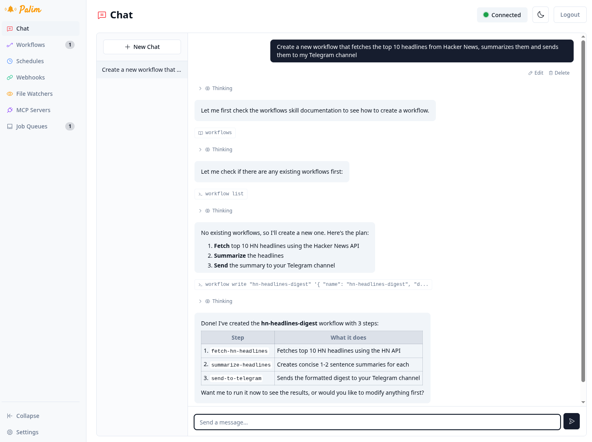

# Palim


> "*All they need is ~~tools~~ shell commands!*"

A personal AI agent that runs on your machine, talks to a local LLM (or any OpenAI-compatible endpoint), and gets things done - from chat conversations and scheduled tasks to file processing and Telegram integration.

Palim runs an LLM-powered agent inside a sandboxed shell. Instead of implementing custom tool functions for every capability, the agent interacts with its environment through shell commands.

You define a working directory where the agent has full read/write access. This directory is mounted into a virtual filesystem powered by just-bash. Extensions and skills expose their functionality as shell programs, keeping the interface uniform and composable.

[](LICENSE)



## Table of Contents

- [Quick Start](#quick-start)
- [Highlights](#highlights)
- [Scope](#scope)
- [Extensions](#extensions)
- [Configuration](#configuration)
  - [Environment Variables](#environment-variables)
  - [Secrets](#secrets)
- [Current State](#current-state)
- [Development](#development)
- [Production](#production)
- [Docker / Podman](#docker--podman)
- [Architecture](#architecture)
- [Tech Stack](#tech-stack)
- [Contributing](#contributing)
- [License](#license)

## Quick Start

**Prerequisites:** [Bun 1.3.14+](https://bun.sh/) and any OpenAI-compatible LLM endpoint.

```bash
bun install        # Install dependencies
bun run setup      # Interactive first-time configuration
bun run start      # Start Palim
```

The setup script creates your `.env`, asks for your LLM endpoint and API key, and builds the frontend. Once running, open `http://localhost:3000`.

After first start, check Settings > Extensions in the web UI to enable the capabilities you want (optional extensions are disabled by default).

## Highlights

- **Conversational AI** - Multi-turn sessions with streamed responses and persistent chat history
- **Local LLM support** - Use any inference engine with an OpenAI-compatible API (llama.cpp, llama-swap, vLLM, etc.)
- **Extension system** - 11 built-in extensions covering webhooks, scheduling, Telegram, workflows, wiki, MCP bridging, and more
- **Sandboxed execution** - The agent's shell runs inside a virtual filesystem where only `AGENT_WORK_DIR` is mounted - file operations are real, but the agent cannot access anything outside that directory

## Scope

- **Local-first AI** - Designed and tested around local LLMs (e.g. via llama.cpp or llama-swap proxy), though any OpenAI-compatible endpoint works
- **Shell-driven actions** - Every non-trivial operation is exposed as a shell command inside the sandboxed workspace, giving the LLM full autonomy to interact with the system
- **No direct secret access** - Secrets are not visible to agents. Extensions and shell commands handle credentials on its behalf. (Note: secrets may still appear in job logs if extensions log them.)
- **System and information integration** - Palim is not intended to be a software development agent. While it can technically do this, its main focus is integrating systems, automating workflows, and managing information

## Extensions

Palim ships with 11 built-in extensions (7 optional, 4 core):
basic

| Extension | Type | Purpose |
| --------- | ---- | ------- |
| `filewatcher` | Core | Configurable directory watchers that emit events on file changes |
| `scheduler` | Core | Cron and interval-based job scheduling with persistence |
| `webhooks` | Core | Authenticated HTTP endpoints for receiving external service events |
| `workflows` | Core | Multi-step job pipelines defined in JSON5 |
| `converter` | Optional | Converts files (PDFs, images) to markdown via vision LLM |
| `error-analyzer` | Optional | Automatic failure analysis and error reporting for jobs and workflows |
| `mcp` | Optional | Bridges MCP (Model Context Protocol) servers into the skill system |
| `steering` | Optional | Injects additional system prompt text to steer agent behavior |
| `telegram` | Optional | Telegram bot integration |
| `web-fetch` | Optional | Fetch and read webpages (replacement for curl, wget, etc.) |
| `wiki` | Optional | Agent skill for reading and writing wiki pages |

Core extensions cannot be deactivated. Optional extensions are disabled by default on first setup - enable the ones you need in the web UI under Settings > Extensions.

For writing your own extensions, see [docs/writing-extensions.md](docs/writing-extensions.md).

## Configuration

### Environment Variables

| Variable | Purpose | Default |
| -------- | ------- | ------- |
| `OPENAI_API_KEY` | LLM provider API key | - |
| `OPENAI_API_BASE_URL` | LLM endpoint base URL | `http://localhost:11434/v1` |
| `OPENAI_DEFAULT_MODEL` | LLM default model | - |
| `AGENT_WORK_DIR` | Agent working directory (mounted into the sandbox) | `.work/` |
| `WEB_HOST` | Web server bind address | `localhost` |
| `WEB_PORT` | Web server port | `3000` |
| `AUTH_TOKEN` | Bearer token for API/WS auth (empty = disabled) | - |
| `DATA_DIR` | Directory for databases and generated content | `<AGENT_WORK_DIR>/.palim/` |
| `EXTENSIONS_DIR` | Custom extensions directory | `src/extensions` |

### Secrets

Palim reads secrets (API keys, tokens) from environment variables. Set them in your `.env` file and you're done.

For runtime secrets used by extensions and workflows, Palim provides a SQLite-backed encrypted vault (AES-256-GCM) with per-key ACL and audit logging. Extensions access secrets via `ctx.secrets.get(key)` / `ctx.secrets.set(key, value)`, and workflows use `{{secret.KEY_NAME}}` template syntax.

For production deployments with encrypted environment files, Palim optionally supports [dotenvx](https://dotenvx.com) - this activates automatically when a `.env.keys` file is present. See [docs/secrets.md](docs/secrets.md) for the full secrets architecture and [docs/api-security-model.md](docs/api-security-model.md) for the API authentication model.

## Current State

- **Local LLMs** - Tested with models in the 20B-35B parameter range (Qwen 3.6, Gemma 4, gpt-oss). Smaller models (like Qwen 3.6 4B) work but may struggle with complex multi-turn tasks. Enabling thinking mode is recommended for most models.
- **Extensions** - Functional but the API is still evolving. An SDK package for third-party extensions is pending.
- **Workflows** - Visual editing in the web UI is WIP.

## Development

Available `bun run` commands:

```bash
bun run dev                      # Backend with file watching
cd frontend && bun run dev       # Frontend dev server (Vite HMR)
bun run check                    # Lint and format (Biome)
bun run test                     # Run tests
bun run cli                      # Interactive sandbox shell (just-bash)
```

`bun run dev` starts the backend with auto-restart on file changes. `bun run start` runs without watching (for production-like usage).

<details>
<summary>Remote access during development</summary>

To access the Vite dev server from another machine on your network:

```bash
cd frontend && bunx vite --host 0.0.0.0
```

</details>

## Production

Build the frontend and run the backend:

```bash
bun install --frozen-lockfile
cd frontend && bun install --frozen-lockfile && bun run build
bun run start
```

Recommendations:

- Set `AUTH_TOKEN` to protect the API and WebSocket endpoints (see [docs/api-security-model.md](docs/api-security-model.md) for the full security model)
- Use a reverse proxy (nginx, Caddy) for TLS termination

## Docker / Podman

A multi-stage [Dockerfile](Dockerfile) and [`docker-compose.yml`](docker-compose.yml) are provided for containerized deployment. Works with both Docker and Podman.

```bash
bun run setup          # Create .env (if you haven't already)
docker build -t palim .
docker compose up
```

See [docs/docker.md](docs/docker.md) for networking setup, local LLM connectivity, volumes, and Podman-specific notes.

## Architecture

```text
src/
├── app/           # Bootstrap and lifecycle orchestration
├── db/            # Drizzle ORM + SQLite (schema, migrations, config store)
├── session/       # Conversation session persistence
├── jobs/          # Job queue definitions (agent, chat)
├── queue/         # ManagedQueue abstraction over bunqueue
├── web/           # Elysia HTTP server, WebSocket, REST routes
├── extensions/    # Plugin system (11 built-in extensions)
│   └── core/      # Non-deactivatable infrastructure extensions
├── secrets/       # Encrypted vault, ACL, audit logging
├── skills/        # Skill loading and YAML frontmatter parsing
├── tools/         # Agent tools (file ops, sandbox shell)
└── utils/         # Shared utilities (logging, validation, commands)

shared/            # Types shared between backend and frontend
frontend/          # Svelte 5 + Vite 8 + Tailwind CSS 4 web UI
.work/             # Default AGENT_WORK_DIR - the agent's workspace (tasks, inbox, wiki, workflows)
```

Key architectural decisions:

- **Sandboxed workspace** - Commands run inside a [just-bash](https://github.com/vercel-labs/just-bash) virtual filesystem. The directory configured via `AGENT_WORK_DIR` is mounted into this sandbox, giving the agent full access to that directory while isolating it from the rest of the host filesystem
- **Job queues** - SQLite-backed via [bunqueue](https://bunqueue.dev/) with stall detection and persistent logging
- **Extensions** - Discovered at runtime, dependency-resolved via topological sort, each receiving a scoped context
- **Skills** - Markdown files with YAML frontmatter; the agent reads them at runtime via `skill read <name>` in the sandbox shell
- **Sessions** - Persisted multi-turn conversations in SQLite with source tracking (chat, telegram, scheduler)

## Tech Stack

| Layer | Technology |
| ----- | ---------- |
| Runtime | [Bun 1.3.14+](https://bun.sh) |
| Language | TypeScript 7.0 (strict mode) |
| Frontend | [Svelte 5](https://svelte.dev/) + Vite 8 + Tailwind CSS 4 |
| Database | SQLite (Bun native) via [Drizzle ORM](https://orm.drizzle.team/) |
| LLM | OpenAI-compatible API |
| Sandbox | [just-bash](https://github.com/vercel-labs/just-bash) |
| Queue | [bunqueue](https://bunqueue.dev/) |

## Contributing

See [CONTRIBUTING.md](CONTRIBUTING.md) for setup instructions, code style guidelines, testing conventions, and PR expectations.

## License

[MIT](LICENSE)
